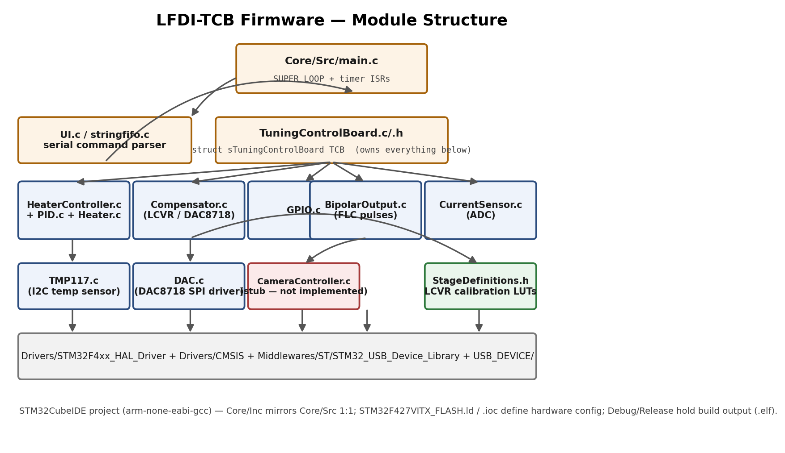
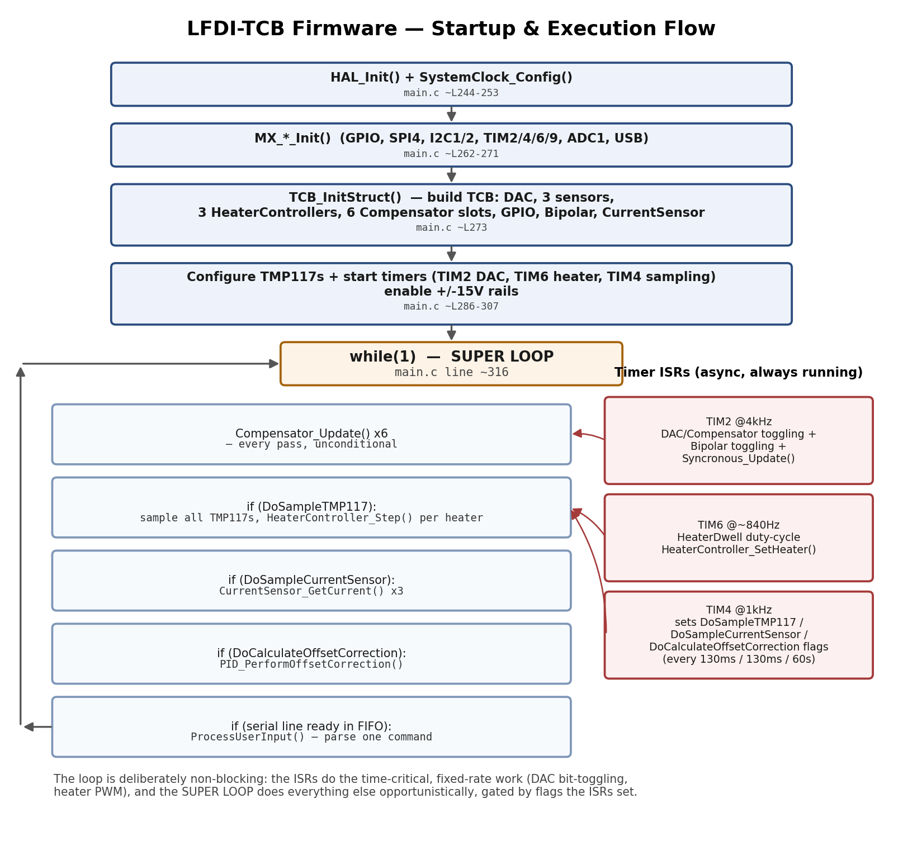

# LFDI-TCB Onboarding Guide

*For new electrical engineers joining the Tuning Control Board firmware. Written 2026-08-26. Not a full design spec — read this first, then go read the code.*

## 1. What this repo is

**LFDI-TCB** is the embedded C firmware that runs on the Tuning Control Board (TCB), the STM32F427VIT6-based board that drives the Lyot Filter Demonstration Instrument's tunable optical stages. It reads three TMP117 I2C temperature sensors, drives an 8-channel DAC8718 SPI DAC (6 channels for LCVR compensator tuning voltages, 2 for bipolar FLC pulse output), runs PID-controlled resistive heaters, and exposes a USB-CDC serial menu for configuration and monitoring. It is a **standalone STM32CubeIDE project** — there is no build system shared with the other two LFDI repos. Within the broader LFDI codebase, **LFDI-TCB is the authoritative source of truth for the serial command protocol**: it is the most actively maintained of the three repos (commits as recently as 2026-02-24), and `LFDI-GUI`'s and `LFDI-API`'s protocol implementations should be judged against what this firmware actually does, not the other way around.

## 2. Repo structure

- **`Core/Src` / `Core/Inc`** — all first-party firmware code, one `.c`/`.h` pair per subsystem. This is almost everything you'll touch.
- **`main.c`** — startup sequence, timer ISRs, and the SUPER LOOP. The entry point for understanding *when* anything runs.
- **`TuningControlBoard.c/.h`** — defines `struct sTuningControlBoard TCB`, the single global struct that owns every subsystem (DAC, sensors, heater controllers, compensators, GPIO, bipolar outputs, current sensors). If you're looking for "where does everything live," it's here.
- **`UI.c`** (~1,700 lines, the largest file) + `stringfifo.c` — the serial command parser. `stringfifo.c` buffers incoming USB bytes into newline-terminated strings; `UI.c` tokenizes and dispatches them into per-menu handlers.
- **`Compensator.c` + `StageDefinitions.h`** — the LCVR tuning logic and its calibration lookup tables. `StageDefinitions.h` is almost entirely data (three ~1200-entry `uint16_t` LUTs) plus one small `struct sStage` definition.
- **`HeaterController.c` + `PID.c` + `Heater.c`** — PID temperature control for the resistive heaters.
- **`DAC.c` + `DAC_Defines.h`** — low-level SPI driver for the DAC8718.
- **`TMP117.c`** — I2C driver for the temperature sensors.
- **`GPIO.c`, `BipolarOutput.c`, `CameraController.c`, `CurrentSensor.c`** — smaller, more recently-added subsystems (see §5).
- **`Drivers/`, `Middlewares/`, `USB_DEVICE/`** — vendor code (ST HAL, CMSIS, USB CDC middleware). You should essentially never need to edit these.
- **Root files** — `.ioc` (STM32CubeMX hardware config, edit via CubeMX/CubeIDE GUI, not by hand), `.cproject`/`.project` (Eclipse/CubeIDE build config, `arm-none-eabi-gcc` toolchain targeting `STM32F427VITx`), `STM32F427VITX_FLASH.ld` (linker script), `Debug/` and `Release/` (build output, `.elf` binaries — the `Debug` config is the one actively used; `Release/*.elf` is stale, dated 2024).

## 3. How it runs

Startup does the usual STM32CubeMX dance (`HAL_Init`, clock config, peripheral `MX_*_Init` calls), then builds the `TCB` struct via `TCB_InitStruct()`, configures the TMP117s, starts three hardware timers, and enables the ±15V analog supply rails — with a 1-second delay between them to let the rails stabilize.

Then it enters the **SUPER LOOP** (`main.c`, `while(1)` at line ~316, matching the Operators Manual's reference to this same line). The loop is deliberately non-blocking and cooperative:

- **`Compensator_Update()`** is called on all 6 compensator slots *every single pass*, unconditionally — this is the fastest-updating thing in the loop.
- Three **flag-gated blocks** run only when a timer ISR has set the corresponding flag: sampling all TMP117s + stepping the heater PID (`DoSampleTMP117`, set every ~130ms by TIM4), sampling the current sensors (`DoSampleCurrentSensor`, also ~130ms), and PID offset correction (`DoCalculateOffsetCorrection`, every 60s).
- One **serial command**, if a complete line is waiting in the USB FIFO, is parsed and dispatched per pass.

The actual time-critical, fixed-rate hardware work happens in the timer ISRs, not the loop: **TIM2 (4kHz)** toggles the DAC8718 channels for both compensators and bipolar outputs and does `Syncronous_Update()`; **TIM6 (~840Hz)** implements heater PWM by toggling `HeaterController_SetHeater()` based on a 200-tick duty cycle (`HeaterDwell`); **TIM4 (1kHz)** is the housekeeping clock that sets the three flags above. This split exists because DAC bit-toggling and heater PWM need firm timing, while temperature sampling (I2C, slow) and serial parsing can tolerate being opportunistic.

## 4. The serial command protocol

The firmware implements a **five-menu** structure, not the three-menu (Main/Controller/Compensator) structure described in the Operators Manual — see §6. All menus are driven from `UI.c`'s `ProcessUserInput()` (line 30), which dispatches on a `SUB_MENU` global to one of five `TranslateUserInput_*Menu()` functions. Each menu lowercases input, strips spaces and `=`, and expands word aliases (e.g. `"controller"`→`"cont"`, `"channel"`→`"c"`) before matching single/short-letter commands.

| Menu | Entered via | Handler | Purpose |
|---|---|---|---|
| Main | (default at boot) | `ProcessUserInput_MainMenu` (line 792) | navigation + global commands (`raw`, `bounce`, `save`/`load`, `wipe`) |
| Controller | `cont` | `ProcessUserInput_HeaterControllerMenu` (line 1074) | heater PID tuning (`KP`, `KD`, `KI`, `IL`, `TG`, `PP`, `SL`, `EC`/`DC`, `EO`/`DO`) |
| Compensator | `comp` | `ProcessUserInput_CompensatorMenu` (line 881) | LCVR channel config (`volt`, `comp`, `wave`, `stage`, `enable`/`disable`, `address`) |
| GPIO | `gpio` | `ProcessUserInput_GPIOMenu` (line 1311) | logic-level output control (added Feb 2026) |
| BipolarOutput | `bipo` | `ProcessUserInput_BipolarOutputMenu` (line 1436) | FLC bipolar pulse config: `voltage`, `frequency`, `pulses`, `enable`/`disable` (added Feb 2026) |

The command list each menu actually claims to support is printed verbatim by its `Show*Help()` function (e.g. `ShowMainHelp()` at line 1726, `ShowHeaterControllerHelp()` at line 1748) — **that's the authoritative reference**, more so than any external doc, because it's generated from the same source as the dispatch logic. There is also an undocumented `set_`/`get_` prefix path at the top of `ProcessUserInput_MainMenu` (routes to `SET_Processing_Tree`/`GET_Processing_Tree`, lines 667/754) that bypasses the menu system entirely.

## 5. Where a new EE should look first

1. **Start in `main.c`.** Read the ISR (`HAL_TIM_PeriodElapsedCallback`, line 114) and the SUPER LOOP (line ~316) before anything else — nearly everything else in the repo exists to be called from one of these two places.
2. **`TuningControlBoard.h`** next — it's 55 lines and tells you the shape of the whole system (what subsystems exist, how many of each).
3. **The LUT format lives in `StageDefinitions.h`** (`struct sStage`) and is consumed in `Compensator.c`'s `Wavelength_to_Voltage()`. Don't touch the `lookup27`/`lookup54`/`lookup108` tables without understanding that they're indexed by a computed pixel/wavelength offset, not by array position alone — read `BaseT_Position_to_BaseT_Voltage()` and `temperature_position_offset()` first.
4. **Before changing anything DAC-related**, read `DAC.c`'s `Set_Voltage_Peak_to_Peak()` and the TIM2 ISR together — the DAC channels are updated by *both* the ISR (bit-toggling between `upper_bound`/`lower_bound`) and application code (which sets those bounds). It's easy to change one side and be confused why output doesn't change.
5. **`GPIO.c`, `BipolarOutput.c`, `CurrentSensor.c`** are the newest code (Jan–Feb 2026) and the most likely to still have rough edges — check git blame/recent commits before assuming established behavior here is final.
6. **`CameraController.c` is a stub.** `CameraController_TriggerCamera()` does nothing (explicit `TODO` in the source). Don't build on top of it assuming it works.
7. **Don't trust `README.md`.** It documents an older struct layout (`struct sController`, `NUMOFCONTROLLERS`) that no longer exists in the code — it predates the `HeaterController`/`Compensator[6]`/`BipolarOutput` refactor. Treat the code as ground truth.

## 6. Known gaps / discrepancies vs. the Operators Manual

- **Menu count mismatch.** The Operators Manual describes a Main/Controller/Compensator menu structure; the firmware has **five** menus (Main, Controller, Compensator, GPIO, BipolarOutput). GPIO and BipolarOutput were added in the last ~7 months (Jan–Feb 2026 commits) and may postdate the manual's last revision.
- **Save/Load are documented but not implemented.** `ShowMainHelp()` itself claims `Load` "reloads the previously saved values (automatic at power-on)" and `Save` "saves the currently configured values" — but the actual handlers just print `"no EEPROM Cannot Load Configuration"` / `"no EEPROM Cannot Save Config"` and do nothing. There is no persistent storage; all configuration is lost on reset/`Bounce`. This is a discrepancy in the firmware's *own* internal documentation, not just against the external manual.
- **`Update`/`Wipe` are also stubs.** The `update` command in the Main menu has its implementation commented out (`//ShowUpdate();`); `wipe` prints "Wiped Configuration" but the actual reset logic is commented out.
- **Compensator count is inconsistent internally.** `TuningControlBoard.h` defines `NUMOFCOMPENSATORS (3)`, but `struct sTuningControlBoard` declares `Compensator[6]`, `TCB_InitStruct()` only initializes indices `0..NUMOFCOMPENSATORS-1` (i.e. 3 of the 6), and the SUPER LOOP hardcodes `Compensator_Update()` calls for indices `0` through `5` regardless. In practice this means compensator slots 3–5 run every loop pass with a zero-initialized (uninitialized) `sCompensator` struct — worth verifying with hardware/logic-analyzer testing before relying on channels 4–6, and worth asking the previous maintainer whether this is intentional (staged rollout of a 6-channel LCVR) or an oversight.
- **`CameraController.c` is unimplemented** (see §5) — if the Operators Manual describes camera-trigger behavior, it is aspirational, not current firmware behavior.
- **`README.md` is stale** relative to the current struct layout (see §5) — don't use it as a reference for current field names.

---
*Diagrams generated from the actual code structure/flow in `main.c` and `TuningControlBoard.h` as of commit `28a06b7`. Source: `docs/onboarding/img/module_structure.png`, `docs/onboarding/img/execution_flow.png`.*
